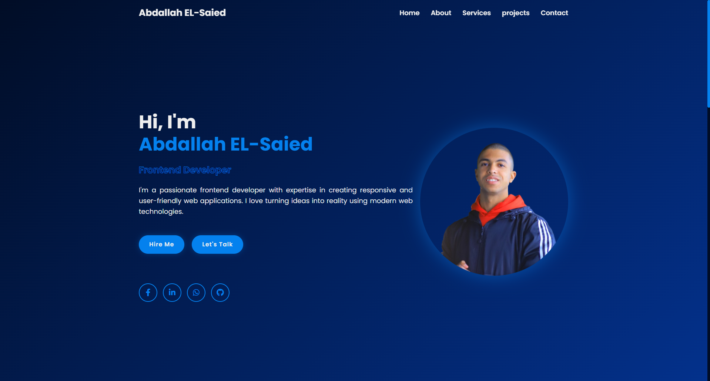
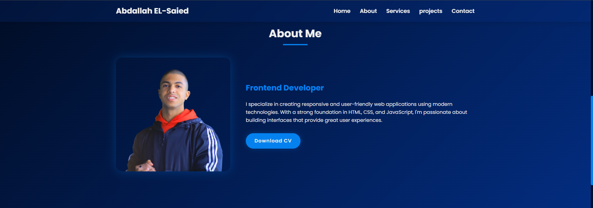
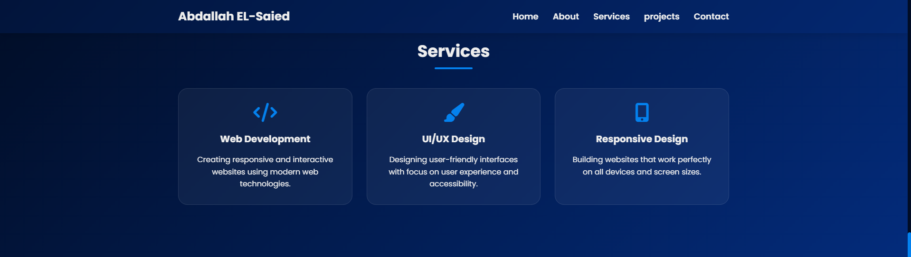
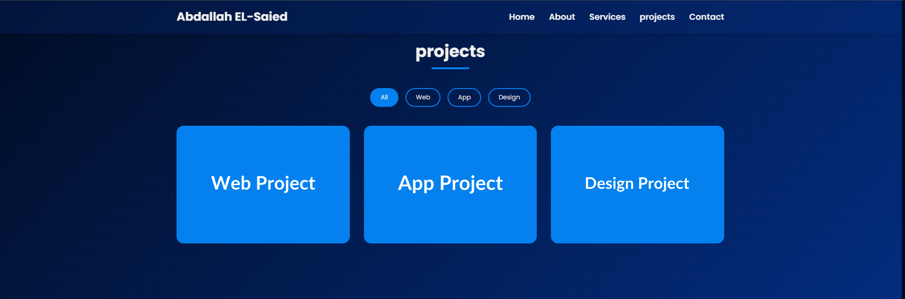
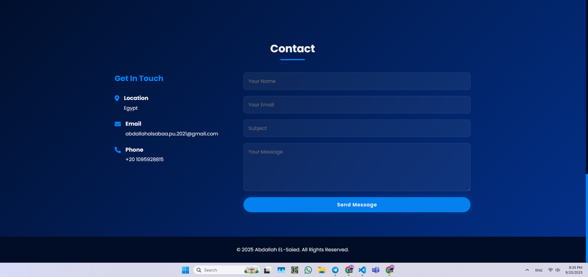

# 🌐 Personal Portfolio – Abdallah EL-Saied

A modern, responsive **personal portfolio website** built with **HTML, CSS, and JavaScript**.  
This project showcases my skills, services, and projects as a **Frontend Developer**, with a clean design, smooth animations, and contact functionality powered by **EmailJS**.

---

## ✨ Features

- **Responsive Design** – Fully optimized for all devices (desktop, tablet, mobile).  
- **Sticky Header** – Transparent navigation bar with scroll effect.  
- **Hero Section** – Profile picture, intro text, and quick call-to-action buttons.  
- **About Me** – Personal bio, skills overview, and CV download.  
- **Services** – Highlight of provided services with styled cards.  
- **Projects Showcase** – Filterable project gallery (Web, App, Design).  
- **Contact Section** – Contact form integrated with **EmailJS** (send messages without backend).  
- **Social Media Integration** – Quick links to LinkedIn, GitHub, WhatsApp, and Facebook.  
- **Custom Animations** – Floating profile picture, hover effects, and smooth transitions.  

---

## 🛠️ Technologies Used

- **HTML5** – Semantic structure.  
- **CSS3** – Modern styling with custom properties, gradients, and media queries.  
- **JavaScript (ES6)** – Interactivity, navbar toggle, project filtering, EmailJS integration.  
- **EmailJS** – Handle contact form submissions without a server.  
- **Font Awesome** – Icons.  
- **Google Fonts** – Poppins typography.  
- **Bootstrap Grid (CDN only)** – Responsive grid system.  

---

## 📂 Project Structure

```
Portfolio/
│── index.html        # Main HTML file
│── style.css         # Custom CSS styles
│── myPhoto.png       # Profile photo
│── README.md         # Project documentation
│── /assets           # (Optional) for projects images, CV, etc.
```

---

## 🚀 Getting Started

### 1️⃣ Clone the repository
```bash
git clone https://github.com/Abdallah-EL-Saied/portfolio.git
cd portfolio
```

### 2️⃣ Open in Browser
Simply open `index.html` in your browser.

### 3️⃣ (Optional) Live Server
If you have **VS Code Live Server extension**, right-click `index.html` → **Open with Live Server**.

---

## ⚙️ EmailJS Setup

1. Create an account on [EmailJS](https://www.emailjs.com/).  
2. Create a new **Email Service**.  
3. Create an **Email Template** and configure form fields (`name`, `email`, `title`, `message`).  
4. Replace these values inside `index.html`:
   ```js
   emailjs.init("YOUR_PUBLIC_KEY");
   emailjs.sendForm("YOUR_SERVICE_ID", "YOUR_TEMPLATE_ID", this)
   ```
5. That’s it – now form submissions will be sent directly to your email inbox.

---

## 📸 Screenshots

### Hero Section


### About Section


### Service Section


### Projects


### Contact


---

## 📌 Future Improvements

- Add **dark/light mode toggle**.  
- Add **animations on scroll** (AOS or custom fade-in).  
- Deploy the portfolio using **GitHub Pages / Vercel / Netlify**.  
- Add a **blog section** for articles and case studies.  

---

## 📬 Contact

- **Email:** abdallahalsabaa.pu.2021@gmail.com  
- **Phone:** +20 1095928815  
- **LinkedIn:** [linkedin.com/in/abdallahelsaied](https://www.linkedin.com/in/abdallahelsaied/)  
- **GitHub:** [github.com/Abdallah-EL-Saied](https://github.com/Abdallah-EL-Saied)  

---

## 🏷️ License

This project is **open-source** and available under the [MIT License](LICENSE).
